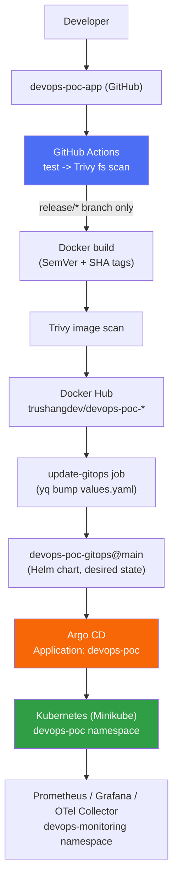
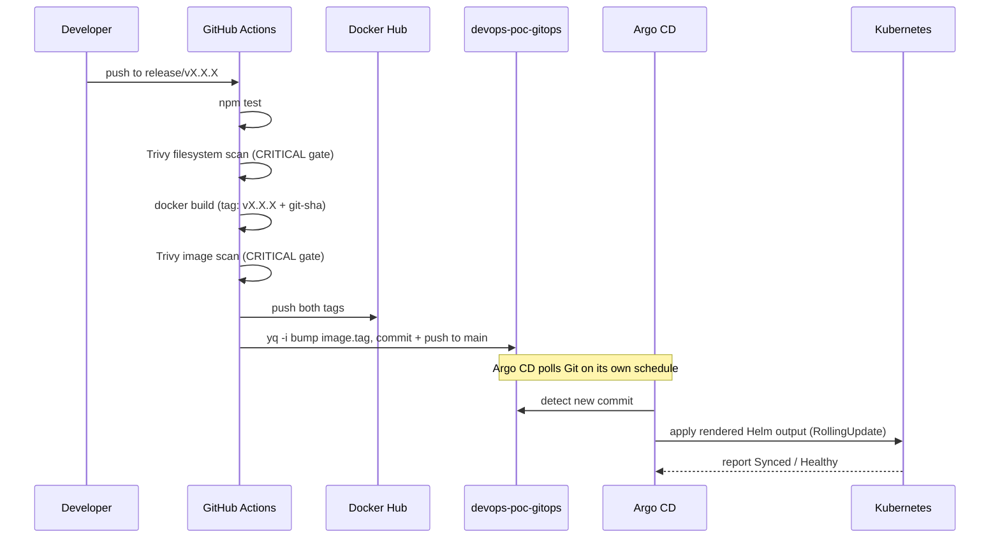
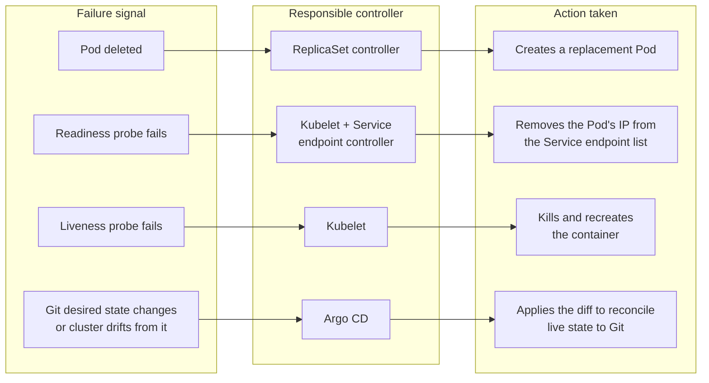

# Architecture

This document explains how the DevOps/GitOps POC is built, layer by layer, and — most importantly — which component is responsible for which kind of failure. See [README.md](README.md) for the project overview and [PROJECT_JOURNEY.md](PROJECT_JOURNEY.md) for how it was built milestone by milestone.

## System Architecture



Six layers, each with one clear responsibility:

| Layer | Owns | Does NOT own |
|---|---|---|
| **Application** (`devops-poc-app/services/*`) | Business logic, tests, `/health` + `/metrics` endpoints | Deployment, infrastructure |
| **CI/CD** (`devops-poc-app/.github/workflows/ci.yml`) | Test, scan, build, tag, publish | Applying anything to Kubernetes |
| **Container registry** (Docker Hub) | Storing immutable, dual-tagged images | Deciding what should run where |
| **GitOps** (`devops-poc-gitops`, Helm) | The declared desired state of the cluster | Executing that state |
| **Kubernetes** (Minikube) | Running workloads, enforcing the declared state | Deciding what the declared state should be |
| **Observability** (`devops-monitoring`) | Making the running state observable | Changing anything |

Argo CD sits between "GitOps" and "Kubernetes" as the only bridge between them — nothing else in this system ever calls `kubectl apply` against the `devops-poc` namespace.

## End-to-End Flow: Code Becomes a Running Service



Nothing in this chain is triggered by a human clicking "deploy." The only two human actions are the original `git push` to a release branch, and — once, ever — the initial `kubectl apply -n argocd -f argocd/application.yaml` that hands the `devops-poc` namespace over to Argo CD in the first place.

**What actually gates each step:**
- A pull request or a plain `develop` push runs tests and a filesystem scan only — no image is ever built from those triggers.
- Only a push to `release/*` proceeds to build/scan/publish/update-GitOps, and every one of those steps carries an explicit `if:` condition checking both the event type and the branch prefix.
- The `update-gitops` job additionally requires (`needs:`) that the build-scan-publish matrix job succeeded for all three services first.

## Control Plane vs Application Workloads

This is a single-node Minikube cluster, so Kubernetes' own control plane (API server, scheduler, controller-manager, etcd) and every workload described here run on the same node — there is no separate control-plane machine to point to. The useful separation in this project is therefore by **namespace**, not by physical topology:

| Namespace | Contains | Role |
|---|---|---|
| `devops-poc` | The three application Deployments/Services/HPAs/ConfigMaps/Secrets | Application workloads |
| `argocd` | The Argo CD installation and the `devops-poc` `Application` resource | GitOps control loop |
| `devops-monitoring` | Prometheus, Grafana, `kube-state-metrics`, Node Exporter, OTel Collector | Observability control loop |

Argo CD and the monitoring stack are themselves ordinary Kubernetes workloads (Pods, Deployments) — they are not part of Kubernetes' own control plane. What makes `argocd` conceptually a "control" namespace is behavioral, not architectural: it's the one namespace whose Pods are allowed to change what's running in `devops-poc`.

## GitOps Reconciliation Flow

Argo CD's `devops-poc` Application (`argocd/application.yaml`) is configured with:

```yaml
source:
  repoURL: https://github.com/trushang-dev/devops-poc-gitops.git
  targetRevision: main
  path: helm/microservices
syncPolicy:
  automated:
    prune: true      # remove resources Git no longer defines
    selfHeal: true    # revert manual/out-of-band cluster edits back to Git
  ignoreDifferences:
    - group: apps
      kind: Deployment
      jsonPointers: [/spec/replicas]
```

Reconciliation is a continuous comparison, not an event-driven trigger:

```text
   Git (main, helm/microservices)
            │
            │  Argo CD polls on its own interval
            ▼
   "What does Git say should exist?"     (desired state)
            │
            ▼
   "What does the devops-poc namespace actually contain?"   (live state)
            │
            ▼
   diff == none  →  Synced
   diff != none  →  OutOfSync  →  apply the diff  →  Synced
```

The `ignoreDifferences` entry exists because the HPA writes to the exact same field (`Deployment.spec.replicas`) that the Helm chart declares statically. Without it, every HPA scale-up would look like drift to Argo CD and get reverted on the next reconciliation — the same class of conflict that plain `helm upgrade` also has to deal with (Helm's own server-side apply can fight a live HPA-owned `replicas` value; see `PROJECT_JOURNEY.md`'s M8 section).

**Measured behavior, not a general guarantee:** in one specific test, an out-of-band `kubectl set env` change was detected (`Synced -> OutOfSync`) and reverted (`OutOfSync -> Synced`) 4 seconds apart, per the Argo CD controller's own logs. That number describes one observed run of this cluster's actual polling interval and reconciliation speed — not a documented SLA of Argo CD in general.

## Failure and Recovery Architecture

This is the part most often collapsed into a single vague "Kubernetes self-heals" statement. It shouldn't be — four different controllers are involved, each reacting to a different signal:



| Component | Watches | Reacts to | Blind to |
|---|---|---|---|
| **Kubelet** (per node) | The containers it's running | Liveness probe failures, container crashes | Kubernetes API-level desired state (Deployments, Git) |
| **Readiness probe** | One container's `/health` | Traffic routability | Whether the container should be restarted |
| **Liveness probe** | One container's `/health` | Container survival | Whether the Pod is currently receiving traffic |
| **Deployment controller** | Its own `spec.replicas`/strategy/template | A change to its own spec | Individual Pod identity, in-cluster drift below the spec level |
| **ReplicaSet controller** | "Do N Pods matching this template currently exist?" | A Pod disappearing, for any reason | *Why* it disappeared, or what should happen to the image tag |
| **Argo CD** | Git vs. the live Kubernetes API, at the object-spec level | A Git commit, or a change to a tracked object's spec | Pod deletion, in-container process signals, node-level events — none of these touch a tracked spec, so none of them are visible to Argo CD |

The practical consequence, demonstrated directly (see `M17_COMPLETION_REPORT.md`): deleting a Pod or freezing the process inside a container never causes Argo CD to report anything other than `Synced` — those events happen entirely below the layer Argo CD watches. Conversely, Argo CD's `selfHeal` reacts to exactly the opposite class of event — a spec-level change with no corresponding Pod-level symptom until the ReplicaSet controller replaces the drifted Pods. These are two non-overlapping safety nets, not one mechanism described two ways.

**Readiness vs. liveness, concretely:** both probes in this project hit the same `GET /health` endpoint and differ only in timing (readiness: 5s initial delay / 10s period; liveness: 15s initial delay / 20s period). When the real Node process was frozen with `kill -STOP`, readiness tripped first — the Pod was marked `Ready: false` and simultaneously dropped from the Service's endpoint list (traffic stopped, nothing else happened) — then liveness tripped roughly 70 seconds later and the kubelet killed and recreated the container. Same failure, same endpoint, two different consequences, purely because of independently configured thresholds.

## Why the CI → GitOps boundary exists

This is worth stating explicitly since it's the single architectural decision the rest of the system is built around: **GitHub Actions is never given Kubernetes credentials.** Its write access ends at a Git repository (`devops-poc-gitops`, via a token scoped only to that one repo). If the CI pipeline were compromised — a malicious dependency, a leaked secret, a bad pull request — the attacker's reachable blast radius is "can push a commit to a Git repo that someone (Argo CD) will later read," not "can run arbitrary commands against a live cluster." Argo CD's pull-based model (the cluster reaches out to Git, rather than an external system reaching into the cluster) is what makes that boundary hold.
